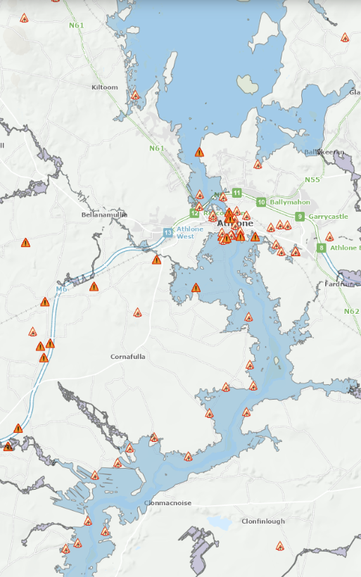

# The Shannon Studio Challenge: Floods & Flows of the Shannon River

## 1) Title
Floods & Flows of the Shannon River

## 2) Background
The Shannon Basin faces both sudden high-water events and long-term flood risk. In early October 2025, during Storm Amy, Waterways Ireland issued Marine Notice No. 115 of 2025 warning of rising water levels and hazardous navigation on the Shannon Navigation. Several locks were overtopped and some connected waterways were temporarily closed. These advisories show how quickly levels can rise and disrupt transport, tourism, and daily life along the river. (Source: https://www.waterwaysireland.org/news/marine-notice-no-115-of-2025-shannon-navigation)

At the same time, the Shannon Town & Environs Flood Relief Scheme highlights chronic exposure near the estuary. Historic embankments from the 1940s–1950s enabled development around Shannon Town and the Airport, but today the area faces both coastal and fluvial risk: storm-driven overtopping at high tide and drainage systems with limited outflow where outfalls are tidally constrained. The Office of Public Works’ (OPW) Catchment Flood Risk Assessment and Management (CFRAM) study identified Shannon Town and the Airport as priorities, and a dedicated scheme has been progressing since 2020 to develop economically viable, environmentally sustainable options. (Source: https://www.floodinfo.ie/frs/en/shannon/home/)

Together, these factors show why the Shannon’s floods matter: people, infrastructure, navigation, and ecosystems are regularly affected by short-notice surges and by legacy drainage constraints. This challenge invites students to use AI, data analytics, software, and multimedia to improve prediction and communication, explore nature-based adaptation virtually, and create interactive tools that help communities, planners, and waterway users make better decisions.

Historical flood map around Athlone town (situated on the banks of the River Shannon):
 
 

 Source: https://www.floodinfo.ie/map/floodmaps/  

## 3) Problem Statement
How might we use AI, software, data analytics, or multimedia to understand, predict, and communicate flooding dynamics in the Shannon Basin with the goal of improving the lives of communities along the river? Propose a solution that leverages open Irish datasets to generate actionable insights, early warning, and compelling public engagement, and explain how the approach can be transferred to other basins.

## 4) Expected Outcomes
- **AI / data models:** rainfall–water-level correlations, nowcasting, early-warning prototypes.  
- **Interactive tools:** web dashboards, simulation sandboxes.  
- **Multimedia storytelling:** short animations, interactive narratives, explainers.  
- **Design concepts:** visual communications for community preparedness or nature-based solutions.
  

## 5) Scope
Data analysis and machine-learning modeling, visualization, mapping, and storytelling (e.g., notebooks, dashboards/web apps, short animations). While scoped to the Shannon Basin, your approach should be adaptable to other river basins by swapping local datasets, recalibrating thresholds/models, and retargeting the audience. Avoid physical engineering designs, fieldwork, and proprietary/confidential data, as those are out of scope.

**Target audience:**
- **Local authorities & Waterways Ireland** — decision support (short-term forecasts, risk maps).  
- **Communities along the River Shannon** — clear alerts/explainers and preparedness visuals.  
- **Emergency services** — timely situational-awareness maps and pinch-point views.
  

## 6) Resources
- Flood map: https://www.floodinfo.ie/map/floodmaps/  
- Climate & rainfall data: https://www.met.ie/climate/available-data/monthly-data  
- Shannon water levels: https://www.waterwaysireland.org/our-waterways/shannon-navigation/water-levels
  

## 7) Difficulty
**Intermediate/Advanced** 

## 8) Inspiration

- **Room for the River (Netherlands):** Designing with floods (wider floodplains, bypass channels) — a model for scenario maps and explainer visuals. (https://www.rijkswaterstaat.nl/en/projects/iconic-structures/room-for-the-river)
- **Google AI Flood Forecasting / Flood Hub:** State-of-the-art ML for riverine flood early warning — useful for modelling baselines and evaluation ideas. (https://blog.google/technology/ai/google-ai-global-flood-forecasting/)
- **Copernicus EMS Rapid Mapping:** Satellite-derived flood extent maps; emulate the mapping/storytelling workflow. (https://mapping.emergency.copernicus.eu/)
- **Flood Factor (First Street Foundation):** Clear risk scoring and UI patterns for communicating household/asset risk (methodology is public). (https://firststreet.org/methodology/flood)

